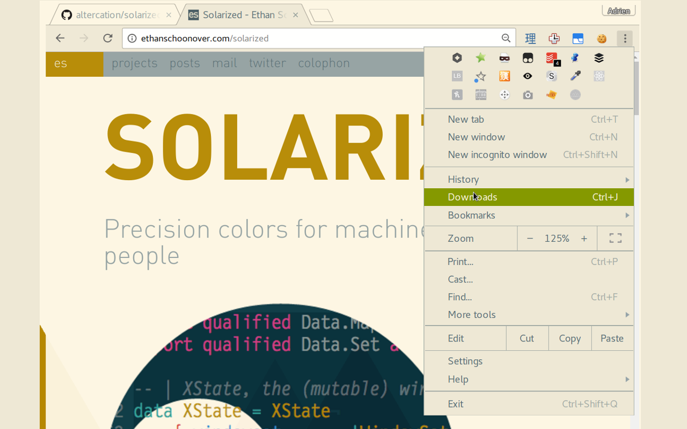

# Google Chrome Solarized Light theme

Used https://chrome.google.com/webstore/detail/solarized-dark/kedemblecjmofcmppbecaagebmokigml as model to build this theme.




## Note

To find the existing theme location in `~/.config/google-chrome/`, use the
following command:

```
$ for f in `find ~/.config/google-chrome/Default/Extensions -name "manifest.json"`;[[ ! -z $(cat $f|grep -i theme) ]] && echo $f
```
